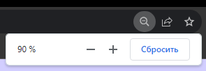
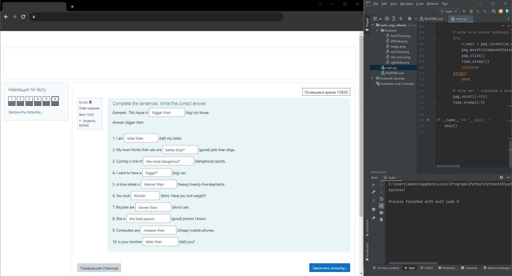
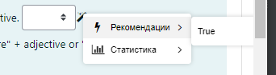
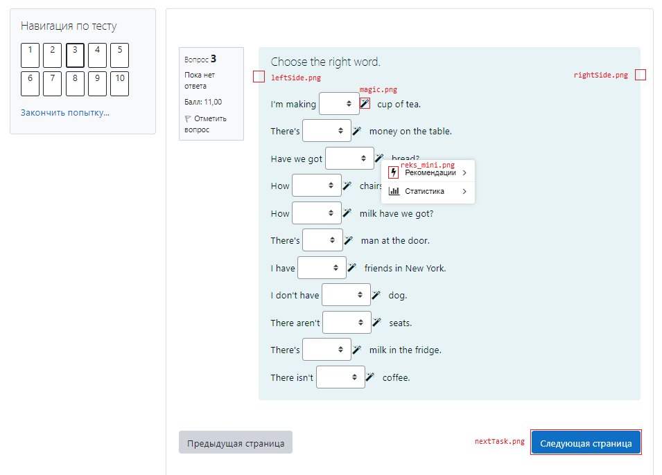
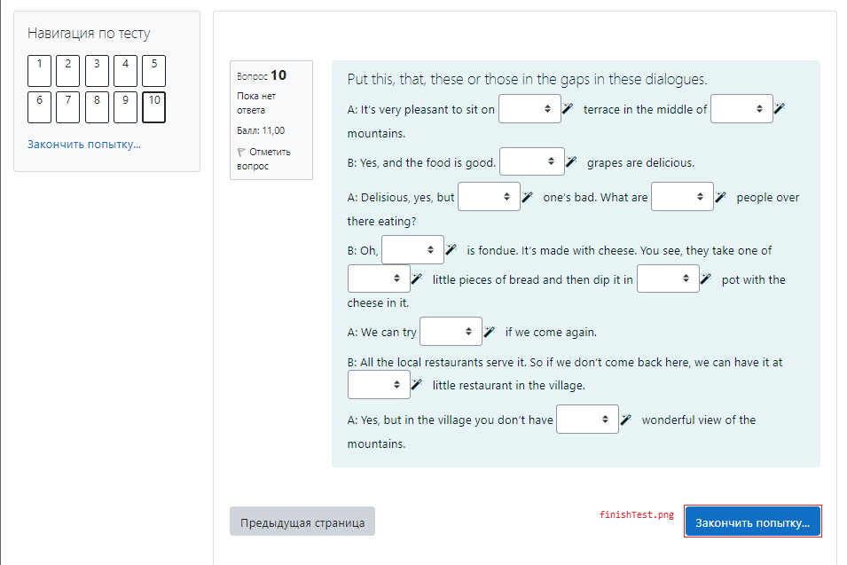

### q: Как использовать?  

a: Поставить масштаб в браузере на 90%:

a: Разделить экран, примерно так: 

(нужно, чтобы на браузеру отводилось больше половины ширины играна, чтобы избежать такого, что зеленая иконка, показывающая, что этот ответ верный, оказалась за границей экрана:)

а: Открыть любое задание и запустить код

a: Готово

 

### q: Что делать, если бот сошел с ума и кликает непонятно куда?

a: Чтобы экстренно остановить бота, нужно резким движением увести мышку в любой из углов экрана (например в левый верхний)

 

### q: Ничего не работает, появляется ошибка `pyautogui.ImageNotFoundException`

a: Если даже при 90%-ом масштабе вылезает такая ошибка, то придется переделать все скриншоты из папки `buttons`

